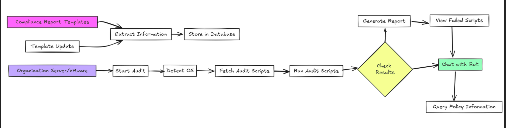
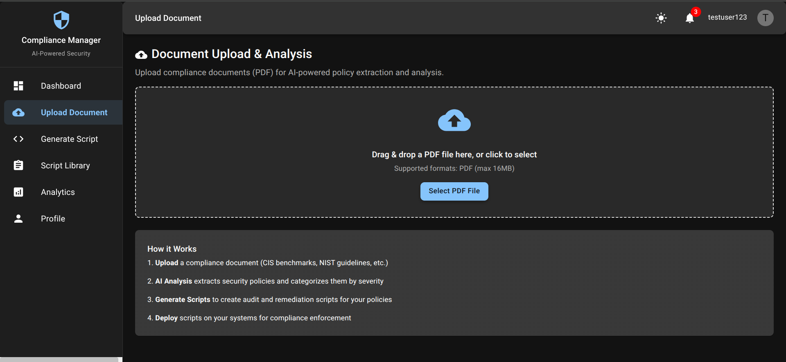
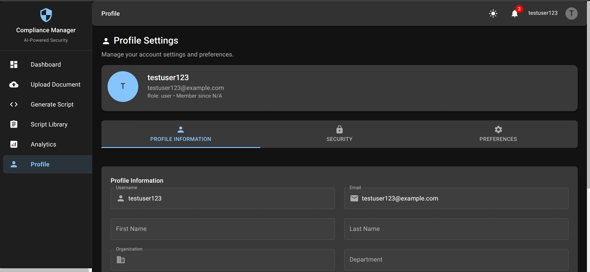
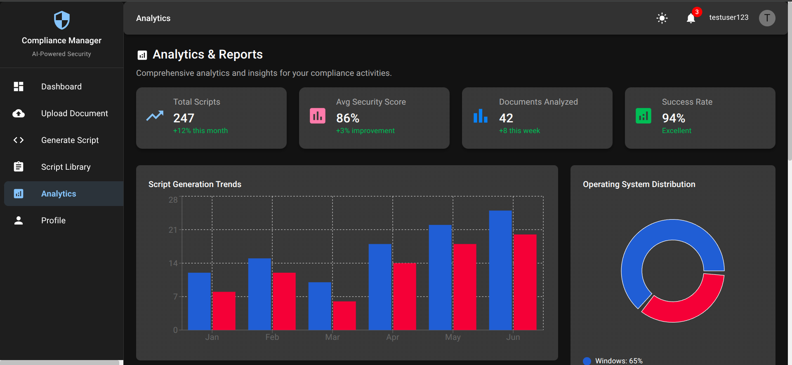
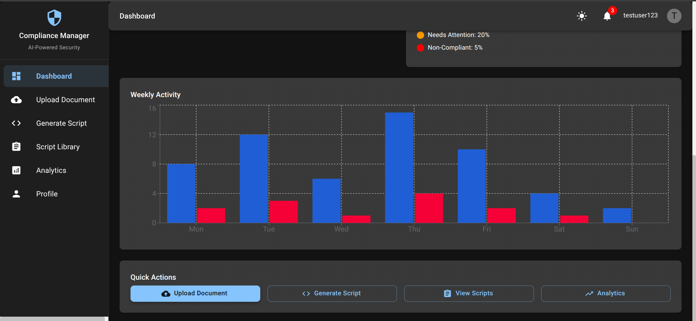
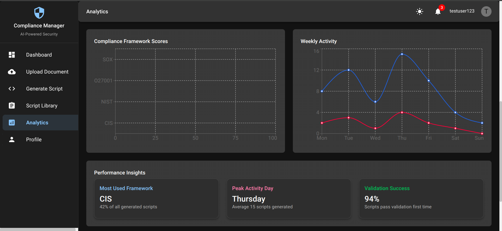
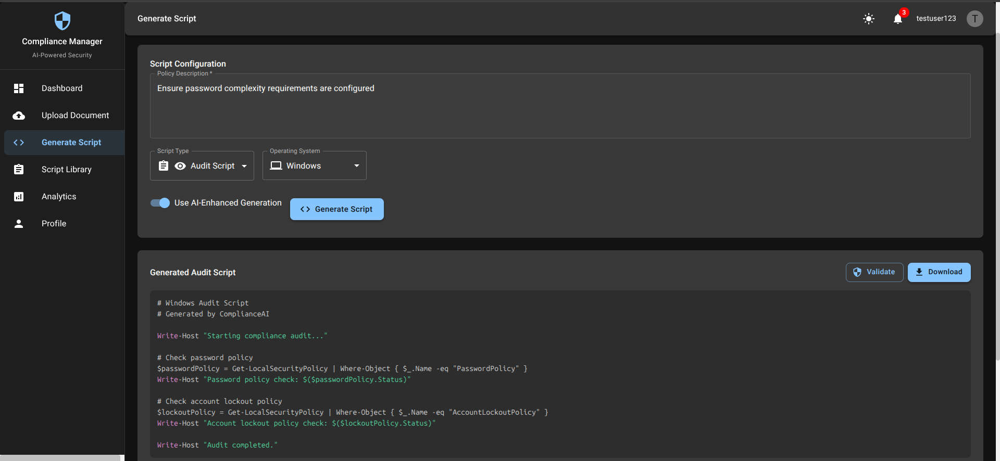
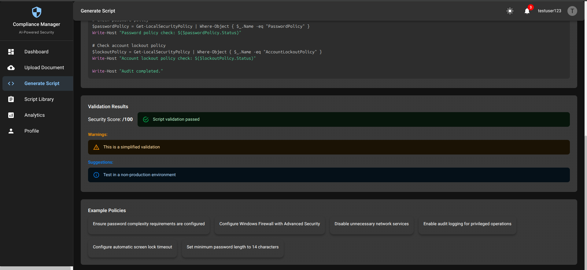
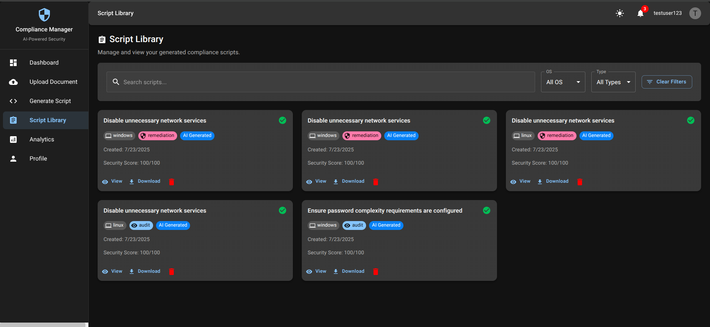
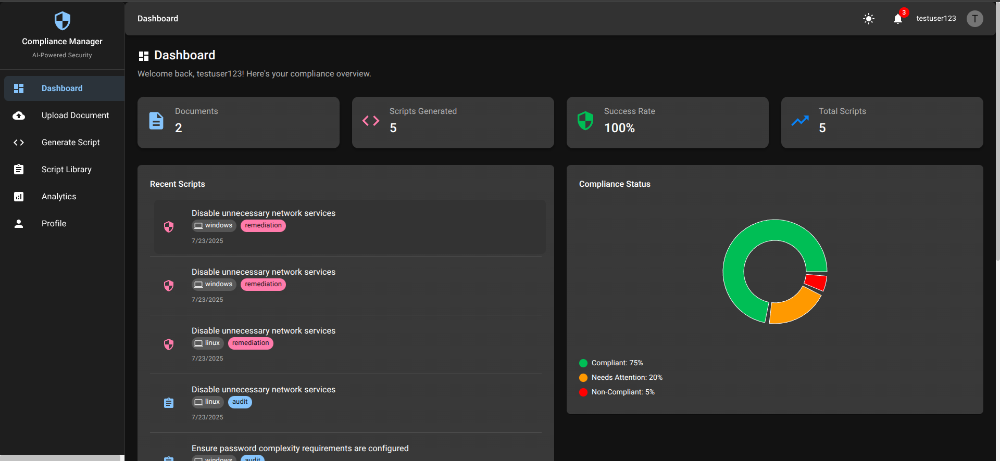

# 🔐 Compliance Automation System

This project was made during the BMC Software's College Hackathon conducted at Pune Institute of Computer Technology, Pune by BMC Software's team.


A comprehensive **MERN Stack** application with AI-powered compliance management, automated script generation, and policy analysis capabilities.

## 🌟 Features

### 🔒 **Authentication & Authorization**
- JWT-based secure authentication
- Role-based access control (Admin, User, Auditor, Manager)
- User profile management with preferences

### 📄 **Document Management**
- PDF document upload and analysis
- Compliance framework detection (CIS, NIST, ISO27001, SOX)
- Policy extraction and requirement analysis
- Document storage with metadata

### ⚡ **AI-Powered Script Generation**
- Automated audit script generation
- Remediation script creation
- Cross-platform support (Windows PowerShell, Linux Bash)
- Script validation and syntax checking

### 📊 **Analytics & Reporting**
- Real-time dashboard analytics
- Compliance status tracking
- User activity monitoring
- System performance metrics

### **Technology Stack**

| Layer | Technology | Purpose |
|-------|------------|---------|
| **Frontend** | React.js, Material-UI, Axios | User Interface & Experience |
| **Backend** | Node.js, Express.js, JWT | API Server & Business Logic |
| **Database** | MongoDB Atlas | Data Storage & Management |
| **AI Service** | Python Flask, CORS | AI/ML Processing & Analysis |
| **Authentication** | JWT, bcrypt | Security & User Management |

## 🚀 Quick Start

### Prerequisites
- Node.js (v16 or higher)
- Python (v3.8 or higher)
- MongoDB Atlas account
- Git

### 1. Clone Repository
```bash
git clone <your-repo-url>
cd Compliance-Automation-Main
```

### 2. Environment Setup

Create `.env` files in each service directory by copying the example files:

```bash
# Backend environment
cp backend/.env.example backend/.env

# Frontend environment  
cp frontend/.env.example frontend/.env

# AI Service environment
cp ai-ml-service/.env.example ai-ml-service/.env
```

Then edit each `.env` file with your actual values:

#### Backend `.env`
```env
NODE_ENV=development
PORT=5000
MONGODB_URI=your_mongodb_atlas_connection_string
JWT_SECRET=your_jwt_secret_key
AI_SERVICE_URL=http://localhost:5001
```

#### Frontend `.env`
```env
REACT_APP_API_URL=http://localhost:5000
REACT_APP_AI_SERVICE_URL=http://localhost:5001
```

#### AI Service `.env`
```env
FLASK_ENV=development
FLASK_APP=app_simple.py
GOOGLE_API_KEY=your_google_api_key_here
```
### 3. Installation & Setup

#### Install Dependencies
```bash
# Backend dependencies
cd backend
npm install

# Frontend dependencies
cd ../frontend
npm install

# AI Service dependencies
cd ../ai-ml-service
pip install -r requirements.txt
```

### 4. Start Services

#### Option 1: Use Setup Scripts
```bash
# Make scripts executable
chmod +x setup.sh start-dev.sh

# Run setup (installs dependencies)
./setup.sh

# Start all services
./start-dev.sh
```

#### Option 2: Manual Start
```bash
# Terminal 1: Start AI Service
cd ai-ml-service
python app_simple.py

# Terminal 2: Start Backend
cd backend
npm run dev

# Terminal 3: Start Frontend
cd frontend
npm start
```

### 5. Access Application
- **Frontend**: http://localhost:3000
- **Backend API**: http://localhost:5000
- **AI Service**: http://localhost:5001

## 🤖 AI Service Features

### Document Analysis
- **Framework Detection**: Automatically identifies compliance frameworks
- **Policy Extraction**: Extracts key requirements and controls
- **Risk Assessment**: Categorizes requirements by risk level
- **Implementation Guidance**: Provides step-by-step implementation steps

### Script Generation
- **Multi-Platform**: Windows PowerShell and Linux Bash support
- **Template-Based**: Uses predefined templates for consistency
- **Customizable**: Adapts to specific compliance requirements
- **Validation**: Built-in syntax and security validation

## 🔒 Security Features

- **JWT Authentication**: Secure token-based authentication
- **Password Hashing**: bcrypt encryption for password storage
- **CORS Protection**: Cross-origin request security
- **Input Validation**: Comprehensive request validation
- **Error Handling**: Secure error responses without data leakage

## 📊 User Roles & Permissions

| Role | Upload Documents | Generate Scripts | View All Scripts | Manage Users | Access Analytics |
|------|------------------|------------------|------------------|--------------|------------------|
| **User** | ✅ | ✅ | ❌ | ❌ | ❌ |
| **Auditor** | ✅ | ✅ | ✅ | ❌ | ✅ |
| **Manager** | ✅ | ✅ | ✅ | ❌ | ✅ |
| **Admin** | ✅ | ✅ | ✅ | ✅ | ✅ |

### Environment Configuration
- Set `NODE_ENV=production` for backend
- Configure MongoDB Atlas connection
- Set secure JWT secrets
- Enable CORS for your domain

## 📸 Screenshots

### System Architecture

*Comprehensive system architecture showing the integration between frontend, backend, and AI services*

### Document Upload

*Intuitive document upload interface with drag-and-drop functionality*

### Profile 


### Analysis and Reports

*Real-time analytics dashboard with compliance status tracking and system metrics*


*AI-powered document analysis with framework detection and policy extraction*


*Automated compliance script generation with customizable parameters*

### Script Generation



*Generated scripts with syntax highlighting and validation features*

### Script Library

*User profile management with role-based access control*

### User Dashboard

*Comprehensive analytics and reporting dashboard with detailed metrics*


### 👥👥 Team Members
- Sameer Dhande
- Yash Amane
- Omkar Deshmukh
- Apurv Wadnere
---
